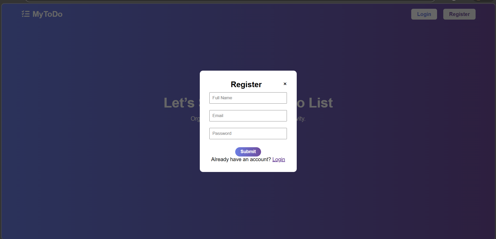
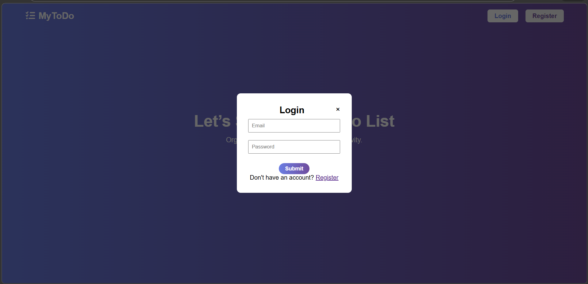
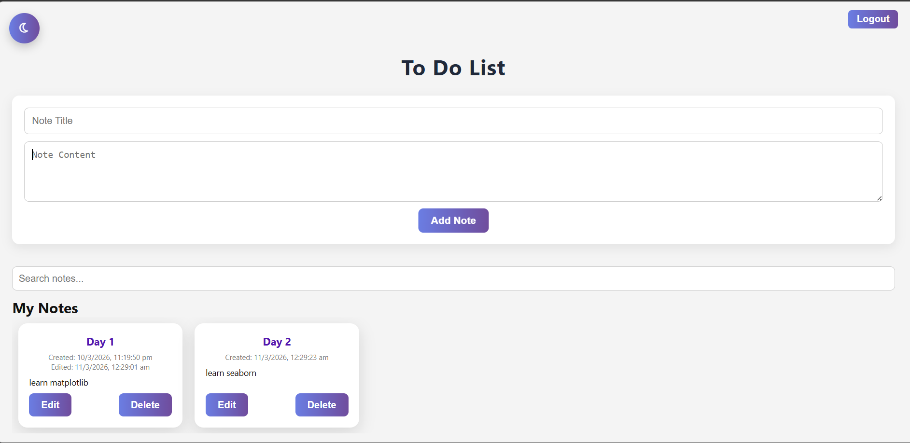
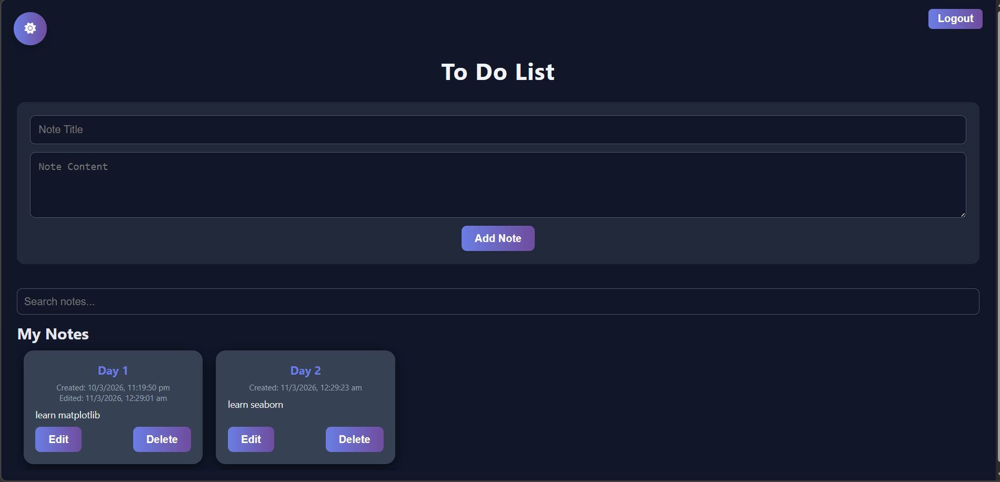
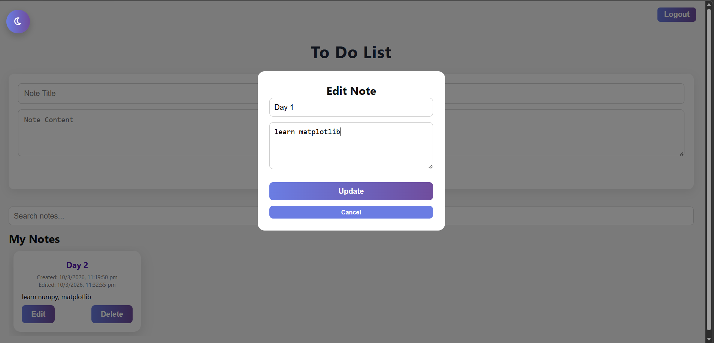

# To-Do Appication

A Full Stack To-Do Application where users can create, edit, search, and delete notes.

## Tech Stack

Frontend
- HTML
- CSS
- JavaScript

Backend
- Node.js
- Express.js

Database
- MongoDB

## Features

- User Registration
- User Login
- Add Notes
- Edit Notes
- Delete Notes
- Search Notes
- Dark Mode

## Screenshots

### Home Page

### Register Page

### Login Page

### To-Do List Page

### Dark Mode

### Update Page

